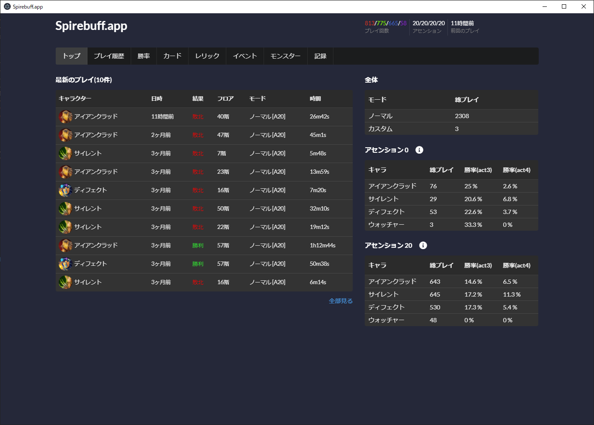

# 1. プロジェクト概要

[Slay the Spire](https://store.steampowered.com/app/646570/Slay_the_Spire) というゲームのプレイ履歴(json)を解析して統計的なデータを表示するためのツール。

Electron 上に TypeScript + React による SPA を乗せている。

自分のためだけに作ったツールだが、当初欲しい機能は全部作ったので記念用に公開。

# 2. ビルド方法

`electron-builder` を使ってゴニョゴニョ。

試行錯誤しながらやっていたせいで詳しい手順を覚えていないのです…ごめんね。

# 3. サポート

随分長いこと触っていないのでちょっと厳しいかも。
自分で読んで動かしたほうが早いと思います。
